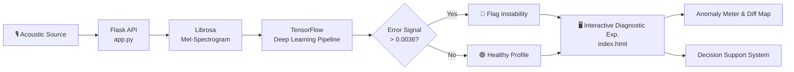

<div align="center">

<!-- Animated Header Banner -->


<!-- Animated Typing -->
<a href="https://mayank-goyal09.github.io/NoiseNinja/templates/index.html">
  
</a>

<br/>

<!-- Badges -->


<br/>

> The final output of your project will be a real-time industrial health dashboard that transforms raw machine sounds into an interactive diagnostic experience. Instead of a static file uploader, the app provides a Live Mel-Spectrogram visualizer that shows the machine's "acoustic fingerprint," a dynamic Anomaly Meter that tracks the reconstruction error against your 0.0036 threshold, and a Difference Map that highlights exactly which frequencies are failing. By using buttons to trigger "Normal" and "Abnormal" sound profiles, you demonstrate a functional Decision Support System that instantly flags mechanical instability, such as bearing wear or fan wobbles, through high-variance "spikes" in the error signal. This creates a professional, end-to-end Industry 4.0 solution that proves you can build, troubleshoot, and deploy a complex deep learning pipeline for real-world smart manufacturing.

### 🌐 [**Experience the Live Demo Here**](https://mayank-goyal09.github.io/NoiseNinja/templates/index.html)

</div>

---

## ✨ Features

<table>
<tr>
<td width="50%">

### 🤖 Unsupervised AI Engine
- Powered by a **TensorFlow Autoencoder** trained *only* on normal sounds
- Bypasses the **Identity Mapping Trap** using specific bottlenecking
- Reconstructs audio effectively to isolate anomalies
- Calculates precise **MSE Reconstruction Loss**

</td>
<td width="50%">

### 📊 Real-Time Diagnostic Dashboard
- **Live Mel-Spectrogram Visualizer** detailing the machine's "acoustic fingerprint"
- **Difference Map** highlighting exactly which frequencies are failing
- **Dynamic Anomaly Meter** evaluating against the 0.0036 threshold
- Interactive, professional **Industry 4.0 Solution**

</td>
</tr>
<tr>
<td width="50%">

### 🎙️ Live Audio Streaming
- Captures sound through the **MediaRecorder API**
- Overrides harsh browser audio filters ensuring accuracy
- Accepts traditional **.WAV audio file** drops
- Full front-to-back integration with the AI backend

</td>
<td width="50%">

### ⚙️ Functional Decision Support
- Buttons to quickly trigger **"Normal"** and **"Abnormal"** sound profiles
- Simulate real-world instability like **bearing wear** or **fan wobbles**
- Identify instability instantly through high-variance "spikes"
- Real-world smart manufacturing reliability

</td>
</tr>
</table>

---

## 🖥️ Dashboard Preview

<div align="center">

```
╔══════════════════════════════════════════════════════════╗
║  ⚙️ NoiseNinja  Live Mic  Upload Audio  Dev Simulation    ║
╠══════════════════════════════════════════════════════════╣
║                                    ┌──────────────────┐  ║
║  ANOMALY METER                     │  System Status   │  ║
║                                    │                  │  ║
║      /\                            │ 🔴 ANOMALY       │  ║
║   /\/  \  Threshold 0.0036         │                  │  ║
║  /      \/\____                    │ Type: Fan Wobble │  ║
║                                    │                  │  ║
║  ─────────────────────────────     └──────────────────┘  ║
║  Live Mel-Spectrogram & Difference Map                   ║
║  ┌──────────────────────────────────────────────────┐    ║
║  │   [Acoustic Fingerprint Heatmap & Diff]          │    ║
║  └──────────────────────────────────────────────────┘    ║
╚══════════════════════════════════════════════════════════╝
```

*☕ "Silence the noise, find the failures."*

</div>

---

## 🏗️ Architecture



---

## 📁 Project Structure

```
NoiseNinja/
│
├── 📓 notebooks/
│   ├── 02_Model_Training_CNN.ipynb         # Explored CNN
│   └── 03_Anomaly_Detection_Autoencoder.py # Autoencoder approach
│
├── 🌐 templates/
│   └── index.html             # Real-time industrial health dashboard
│
├── 🧠 anomaly_detection_autoencoder.h5     # Trained AI model weights
├── 🖥️ app.py                  # Flask endpoints & DL Pipeline
├── 📋 requirements.txt        # Deep learning dependencies
└── 📖 README.md               # You are here
```

---

## 🚀 Quick Start

### Prerequisites

```bash
# 1. Clone the repo
git clone https://github.com/mayank-goyal09/NoiseNinja.git
cd NoiseNinja

# 2. Install dependencies
pip install -r requirements.txt
```

### Run

```bash
# Start the Flask backend server
python app.py

# Open in browser
# → http://127.0.0.1:5000/
```

---

## 🔌 API Reference

| Endpoint | Method | Description |
|----------|--------|-------------|
| `/` | GET | Serves the interactive diagnostic experience |
| `/predict` | POST | Audio processing through DL pipeline & difference mapping |
| `/simulate/{status}` | GET | Triggers "Normal" and "Abnormal" profiles (e.g., bearing wear) |

---

## 🛠️ Tech Stack

<div align="center">

| Layer | Technology |
|-------|-----------|
| **Backend** | Flask |
| **Deep Learning** | TensorFlow / Keras (Unsupervised Autoencoder) |
| **Acoustic Pre-processing**| Librosa |
| **Frontend UI** | HTML5, CSS, Vanilla JS |
| **Data Visualization** | Chart.js |

</div>

---

## 🗺️ Roadmap

- [x] Initial supervised CNN approach
- [x] Pivot to Unsupervised Autoencoder
- [x] Overcome the Identity Mapping Trap
- [x] Calibrate precise detection accuracy (Threshold: 0.0036)
- [x] Real-time industrial health dashboard
- [x] Live Microphone & Difference Map integration
- [ ] Connect physical IoT decibel/audio sensors
- [ ] Implement cloud data logging for anomalies
- [ ] Email/SMS alerts when an anomaly is detected

---

## 👨‍💻 Author

<div align="center">

<a href="https://mayank-goyal09.github.io/">
  
</a>

<br/><br/>

[](https://mayank-goyal09.github.io/)
[](https://github.com/mayank-goyal09)

</div>

---

<!-- Footer Wave -->

