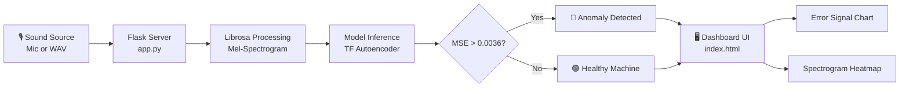

<div align="center">

<!-- Animated Header Banner -->


<!-- Animated Typing -->
<a href="https://mayank-goyal09.github.io/NoiseNinja/templates/index.html">
  
</a>

<br/>

<!-- Badges -->


<br/>

> **NoiseNinja** listens to the acoustic footprint of industrial machines and uses an unsupervised deep learning Autoencoder to detect microscopic mechanical anomalies before they become catastrophic failures.

### 🌐 [**Experience the Live Dashboard Here**](https://mayank-goyal09.github.io/NoiseNinja/templates/index.html)

</div>

---

## ✨ Features

<table>
<tr>
<td width="50%">

### 🤖 Unsupervised AI Engine
- Powered by a **TensorFlow Autoencoder** trained *only* on healthy data
- Safely escapes the **"Identity Mapping Trap"** with compressed bottleneck
- Real-time **0.0036 MSE Loss Threshold** for pinpoint accuracy
- Catches unseen mechanical failures autonomously

</td>
<td width="50%">

### 🎛️ Acoustic Dashboard
- Sleek **Glassmorphism UI** with modern dark mode
- Real-time anomaly **Error Signal Charts** via Chart.js
- Extracted **Mel-Spectrogram Heatmaps** on the fly
- Dynamic Status Badges prioritizing industrial health

</td>
</tr>
<tr>
<td width="50%">

### 🎙️ Live Microphone Input
- Captures audio seamlessly via **MediaRecorder API**
- Explicitly disables browser audio filters (echo cancellation/noise suppression)
- Supports direct **.WAV File Uploads**
- Processes raw signals for ultimate integrity

</td>
<td width="50%">

### ⚙️ Simulation Mode
- Test logic instantly without breaking physical hardware
- Built-in **"Healthy"** and **"Bearing Wear"** toggles
- Observes the neural network spike in real-time
- Perfect for demonstrations and debugging

</td>
</tr>
</table>

---

## 🖥️ Dashboard Preview

<div align="center">

```
╔══════════════════════════════════════════════════════════╗
║  🎸 NoiseNinja   Live Recording   Upload File   Simulate ║
╠══════════════════════════════════════════════════════════╣
║                                    ┌──────────────────┐  ║
║  ANOMALY METER                     │  Status          │  ║
║                                    │                  │  ║
║  [Chart: Error Signal over Time]   │ 🔴 ANOMALY       │  ║
║                                    │                  │  ║
║                                    │ Confidence: 99%  │  ║
║                                    │                  │  ║
║  ─────────────────────────────     └──────────────────┘  ║
║  Mel-Spectrogram Heatmap                                 ║
║  ┌──────────────────────────────────────────────────┐    ║
║  │   [Heatmap Visualizing Raw Audio Frequencies]    │    ║
║  └──────────────────────────────────────────────────┘    ║
╚══════════════════════════════════════════════════════════╝
```

*☕ "Silence the noise, find the failures."*

</div>

---

## 🏗️ Architecture



---

## 📁 Project Structure

```
NoiseNinja/
│
├── 📓 notebooks/
│   ├── 02_Model_Training_CNN.ipynb         # Initial CNN explorations
│   └── 03_Anomaly_Detection_Autoencoder.py # Autoencoder creation & training
│
├── 🌐 templates/
│   └── index.html             # Dashboard UI, Glassmorphism, Chart.js logic
│
├── 🧠 anomaly_detection_autoencoder.h5     # Trained Keras model
├── 🖥️ app.py                  # Flask backend (Audio processing & Inference)
├── 📋 requirements.txt        # Python dependencies
└── 📖 README.md               # You are here
```

---

## 🚀 Quick Start

### Prerequisites

```bash
# 1. Clone the repo
git clone https://github.com/mayank-goyal09/NoiseNinja.git
cd NoiseNinja

# 2. Install dependencies
pip install -r requirements.txt
```

### Run

```bash
# Start the Flask backend server
python app.py

# Open in browser
# → http://127.0.0.1:5000/
```

---

## 🔌 API Reference

| Endpoint | Method | Description |
|----------|--------|-------------|
| `/` | GET | Serves the NoiseNinja dashboard |
| `/predict` | POST | Submits audio data (file/blob) for AI inference |
| `/simulate/{status}` | GET | Tests response with "healthy" or "abnormal" dummy data |

---

## 🛠️ Tech Stack

<div align="center">

| Layer | Technology |
|-------|-----------|
| **Backend** | Flask |
| **AI Model** | TensorFlow / Keras (Unsupervised Autoencoder) |
| **Audio Processing**| Librosa |
| **Frontend UI** | HTML5, CSS (Glassmorphism), Vanilla JS |
| **Data Viz** | Chart.js |

</div>

---

## 🗺️ Roadmap

- [x] Initial supervised CNN approach
- [x] Pivot to Unsupervised Autoencoder
- [x] Overcome the Identity Mapping Trap
- [x] Calibrate precise detection accuracy (Threshold: 0.0036)
- [x] Live dashboard with glassmorphism UI
- [x] Microphone integration with filter bypassing
- [ ] Connect physical IoT decibel/audio sensors
- [ ] Implement cloud data logging for anomalies
- [ ] Email/SMS alerts when an anomaly is detected

---
