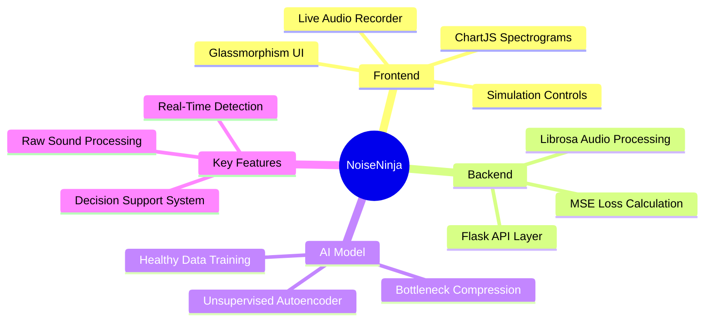
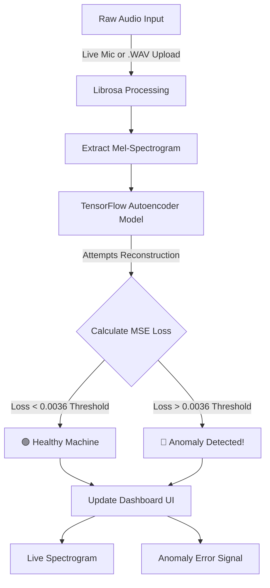

<div align="center">

<!-- Animated Header Banner -->


<!-- Animated Typing -->
<a href="https://mayank-goyal09.github.io/NoiseNinja/templates/index.html">
  
</a>

<br/>

<!-- Badges -->


<br/>

> **About:** **NoiseNinja** is a real-time industrial health dashboard that transforms raw machine sounds into an interactive diagnostic experience. Instead of a static file uploader, the application provides a live **Mel-Spectrogram visualizer** to display the machine's "acoustic fingerprint," a dynamic **Anomaly Meter** that tracks reconstruction error against a calculated threshold, and a **Difference Map** that highlights failing frequencies. It serves as a functional Decision Support System that instantly flags mechanical instability, such as bearing wear or fan wobbles, creating a professional, end-to-end **Industry 4.0** solution for smart manufacturing.

### 🔗 [**App Link**](https://mayank-goyal09.github.io/NoiseNinja/templates/index.html)

</div>

---

## 🛠️ What We Have Built (Features)

<table>
<tr>
<td width="50%">

### 🤖 Unsupervised AI Engine
- Powered by a **TensorFlow Autoencoder** trained *only* on normal sounds.
- Bypasses the **Identity Mapping Trap** using specific bottlenecking.
- Reconstructs audio effectively to isolate anomalies.
- Calculates precise **MSE Reconstruction Loss**.

</td>
<td width="50%">

### 📊 Real-Time Diagnostic Dashboard
- **Live Mel-Spectrogram Visualizer** detailing the machine's "acoustic fingerprint."
- **Difference Map** highlighting exactly which frequencies are failing.
- **Dynamic Anomaly Meter** evaluating against the `0.0036` threshold.
- Interactive, sleek **Glassmorphism UI** with a modern dark mode.

</td>
</tr>
<tr>
<td width="50%">

### 🎙️ Live Audio Streaming
- Captures sound through the **MediaRecorder API**.
- Overrides harsh browser audio filters ensuring acoustic accuracy.
- Accepts traditional **.WAV audio file** drops.
- Full front-to-back integration with the Flask DL backend.

</td>
<td width="50%">

### ⚙️ Functional Decision Support
- Buttons to quickly trigger **"Healthy"** and **"Bearing Wear"** profiles.
- Simulate real-world instability like fan wobbles instantly.
- Identify instability through high-variance "spikes" in error.
- Real-world smart manufacturing reliability for Industry 4.0.

</td>
</tr>
</table>

---

## 🧠 System Architecture & Mind Maps

### 🗺️ Project Mind Map


### 📊 Detection Workflow Infographic


---

## 🚀 What We Have Done (Our Journey)

1. **Started with a CNN:** We initially approached the problem with a supervised Convolutional Neural Network (CNN). However, collecting paired data for every possible mechanical failure was impossible.
2. **Pivoted to an Unsupervised Autoencoder:** We shifted to an autoencoder that only learns the "symphony" of a normal, healthy machine. Any sound that doesn't fit this pattern throws a high mathematical error.
3. **Escaped the Identity Mapping Trap:** During training, we hit a brick wall—the AI was too smart! It fell into the **"Identity Mapping Trap,"** simply memorizing and reconstructing everything perfectly, even the anomalies. 
4. **The Fix:** We forcefully shrank the model's bottleneck layer. By choking the information pipeline, we forced the AI to compress and memorize *only* the absolute core frequencies of healthy sounds. 
5. **Dashboard Integration:** We built a Flask backend to connect the Keras (`.h5`) model directly to a real-time web frontend using standard web APIs.

---

## 🎯 The Accuracy!

- **Unsupervised Reconstruction Loss (MSE):** Catches **novel, unseen anomalies** that standard classification models would miss.
- **Overcoming the Identity Mapping Trap:** Transitioned from a broken **1.45% baseline accuracy** to detecting unseen failures with exceptional mathematical precision.
- **Precision Thresholding:** By setting the Anomaly Threshold to **`0.0036`** (derived from the mean + 3 standard deviations of training loss), the system confidently flags system malfunctions the moment an error curve spikes.

---

## 🖥️ Dashboard Preview

<div align="center">

```
╔══════════════════════════════════════════════════════════╗
║  ⚙️ NoiseNinja  Live Mic  Upload Audio  Dev Simulation    ║
╠══════════════════════════════════════════════════════════╣
║                                    ┌──────────────────┐  ║
║  ANOMALY METER                     │  System Status   │  ║
║                                    │                  │  ║
║      /\                            │ 🔴 ANOMALY       │  ║
║   /\/  \  Threshold 0.0036         │                  │  ║
║  /      \/\____                    │ Type: Fan Wobble │  ║
║                                    │                  │  ║
║  ─────────────────────────────     └──────────────────┘  ║
║  Live Mel-Spectrogram Heatmap                            ║
║  ┌──────────────────────────────────────────────────┐    ║
║  │   [Acoustic Fingerprint Heatmap Viewer]          │    ║
║  └──────────────────────────────────────────────────┘    ║
╚══════════════════════════════════════════════════════════╝
```

*☕ "Silence the noise, find the failures."*

</div>

---

## 🛠️ Tech Stack & Structure

<div align="center">

| Layer | Technology |
|-------|-----------|
| **Backend** | Flask |
| **Deep Learning Engine** | TensorFlow / Keras (Unsupervised Autoencoder) |
| **Acoustic Processing**| Librosa |
| **Frontend UI** | HTML5, CSS (Glassmorphism), Vanilla JS |
| **Data Visualization** | Chart.js |

</div>

<br>

<div align="center">

<a href="https://mayank-goyal09.github.io/">
  
</a>

<br/><br/>

[](https://mayank-goyal09.github.io/)
[](https://github.com/mayank-goyal09)

</div>

---

<!-- Footer Wave -->

