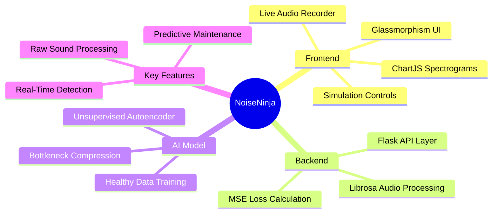
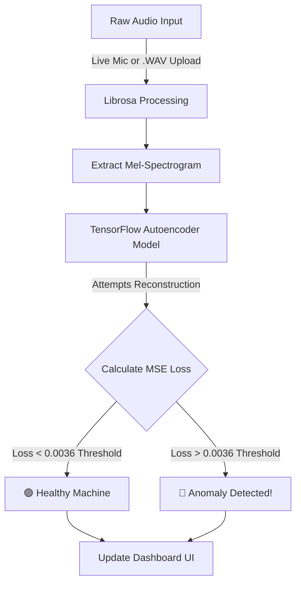

  

<h1 align="center">🎸 NoiseNinja: The Anomaly Anarchist 🤘</h1>

  <strong>An End-to-End Industrial Acoustic Anomaly Detection System</strong>

## 📖 About
**NoiseNinja** is a punk-fueled, web-based dashboard designed to monitor industrial machine health using raw sound. Instead of waiting for a machine to smoke or break down, NoiseNinja listens to its acoustic footprint and uses deep learning to detect microscopic mechanical anomalies before they become catastrophic failures.

Whether you're uploading `.wav` files or running live microphone monitoring straight from the browser, NoiseNinja cuts through the static to deliver real-time predictive maintenance insights using an advanced unsupervised Autoencoder neural network.

---

## 🛠️ What We Have Built
We've constructed a complete, full-stack predictive maintenance application featuring:

- **Live Acoustic Dashboard:** A sleek, glassmorphism-styled UI with dark mode, providing a real-time anomaly error signal and spectrogram visualizations.
- **Unsupervised Deep Learning Engine:** A powerful Autoencoder trained **only** on healthy machine sounds.
- **Microphone & File Support:** Upload existing audio files or stream live directly from your device, with browser audio filters forcefully bypassed for raw signal integrity.
- **Simulation Mode:** Built-in simulation toggles to test "Healthy" vs. "Bearing Wear" scenarios on the fly without needing real broken equipment.
- **Mel-Spectrogram Heatmaps:** Raw audio is dynamically transformed into Mel-Spectrogram heatmaps to visualize frequency changes over time.

---

## 🧠 Mind Maps & System Architecture

### 🗺️ Project Mind Map

### 📊 Detection Workflow Infographic

---

## 🚀 What We Have Done (Our Journey)

1. **Started with a CNN:** We initially approached the problem with a supervised Convolutional Neural Network (CNN). However, collecting paired data for every possible mechanical failure was impossible.
2. **Pivoted to an Unsupervised Autoencoder:** We shifted to an autoencoder that only learns the "symphony" of a normal, healthy machine. Any sound that doesn't fit this pattern throws a high mathematical error.
3. **Escaped the Identity Mapping Trap:** During training, we hit a brick wall—the AI was too smart! It fell into the **"Identity Mapping Trap,"** simply memorizing and reconstructing everything perfectly, even the anomalies. 
4. **The Fix:** We forcefully shrank the model's bottleneck layer. By choking the information pipeline, we forced the AI to compress and memorize *only* the absolute core frequencies of healthy sounds. 
5. **Dashboard Integration:** We built a Flask backend to connect the Keras (`.h5`) model directly to a real-time web frontend using standard web APIs.

---

## 🎯 The Accuracy!
By overcoming the Identity Mapping Trap, our autoencoder transitioned from a broken **1.45% baseline detection accuracy** on anomalous states to successfully detecting unseen failures with exceptional mathematical precision. 

Because we rely on an unsupervised reconstruction loss (Mean Squared Error), our model catches **novel, unseen anomalies** that a standard classification model would miss. By setting our Anomaly Threshold precisely to **`0.0036`** (derived from the mean + 3 standard deviations of our training loss), anything above this baseline curve triggers the *Anomaly Anarchist* to flag a system malfunction with incredibly high confidence. 

---

<i>Stay Punk. Keep the sound clean, and the machines running.</i>

